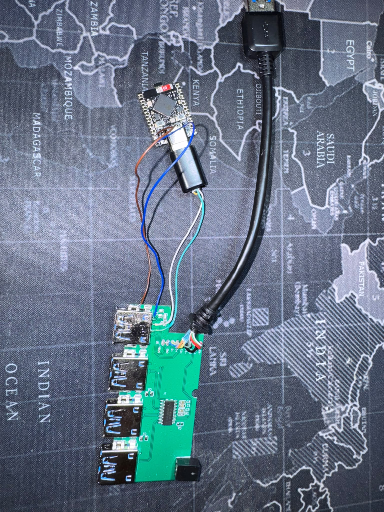
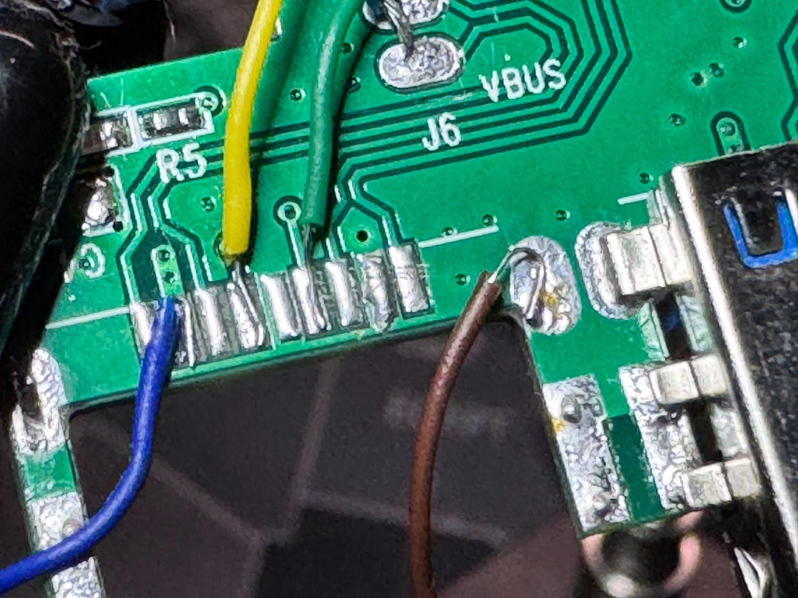
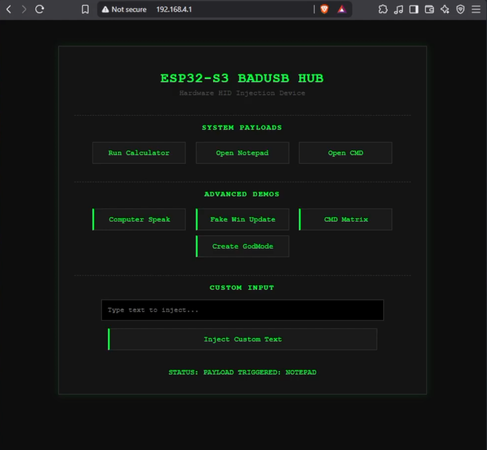

<div align="center">

# Hardware-Level BadUSB Hub

### An ESP32-S3 microsoldered inside a real USB hub to act as a native HID keyboard — triggered from a wireless web UI.


</div>

---

## Overview

This is a **hardware-level HID (Human Interface Device) injection** build. Rather than plugging in an obvious USB stick or wiring things up on a breadboard, I embedded an **ESP32-S3 directly into a commercial USB hub** — soldered onto the internal PCB traces so the whole thing still looks and behaves like an ordinary hub at a glance.

Once connected, the device enumerates on the host as a **native USB keyboard** and can run pre-defined keystroke payloads. It also hosts its **own Wi-Fi web interface**, so payloads can be selected, customized, and triggered wirelessly instead of being hardcoded and reflashed each time.

I built this to actually understand *how* HID-injection attacks work at the physical layer — not just to read about them — which is the direction I'm growing in: hardware / red-team security.

> [!WARNING]
> Built strictly for **education and authorized demonstration**. It contains **no destructive payloads**. See the [Disclaimer](#-disclaimer) before doing anything with a device like this.

<div align="center">



*Fig 1 — The finished device. Indistinguishable from a normal USB hub at a glance.*

</div>

---

## 🛠️ Hardware Implementation

The interesting part of this project isn't the code — it's the **microsoldering**. The goal was to make the ESP32 *become* the hub, at the trace level, with no external adapters.

The process:

1. **Port desoldering** — removed one of the hub's USB ports with a **hot-air rework station** to expose the internal PCB pads and traces.
2. **Trace identification** — probed and mapped the four lines that matter: **D+ (Data+), D− (Data−), VCC, and GND**, verifying each one with a **multimeter**.
3. **Direct microsoldering** — soldered the ESP32-S3's USB lines **directly onto those traces**. The original port's internal connections were severed, so the port now acts purely as a physical anchor/housing — the ESP32 sits in its place at the hardware level.
4. **Permanent assembly** — everything is fixed onto the PCB (no breadboard, no Dupont wires), for a stable, clean form factor.

<div align="center">



*Fig 2 — Close-up of the joints. D+, D−, VCC and GND wired straight from the ESP32-S3 to the hub's PCB traces.*

</div>

---

## 💻 Software & Features

Firmware is written in **C++ (Arduino / PlatformIO)**. It uses the ESP32-S3's native USB-OTG stack (**TinyUSB**) to emulate a keyboard while, at the same time, running an **async web server** over its own Wi-Fi access point.

**Core features**

- **Native USB HID** — hardware-level TinyUSB on the ESP32-S3, not a software bridge.
- **Wireless web UI** — the ESP32 hosts its own Wi-Fi AP; connecting to it opens a clean dark-mode dashboard to fire payloads.
- **Non-blocking execution** — the web server stays fully responsive while the device is typing.
- **Real-time custom input** — a text field injects any user-defined string into the active window on demand.
- **Thermal & power tuning** — CPU underclocked to 80 MHz and Wi-Fi TX power reduced, so it stays cool and draws minimal power from the host.

<div align="center">



*Fig 3 — The on-device dashboard used to trigger payloads.*

</div>

**Demo payloads (all harmless, for showing how HID injection works):**

| Payload | What it does |
| :--- | :--- |
| Run Calculator / Notepad / CMD | Basic "it works" OS-interaction tests |
| Custom text injection | Types any string you type in the UI into the active window |
| Computer Speak | Uses the Windows Speech Synthesizer to make the host talk |
| CMD Matrix | Opens a green terminal that recursively lists the C: drive (visual effect) |
| GodMode folder | Creates the Windows "GodMode" settings folder on the Desktop |
| Fake Windows Update | Opens a full-screen fake update screen (classic demo prank) |

---

## ⚙️ Tech Stack

| Component | Technology |
| :--- | :--- |
| **MCU** | ESP32-S3 |
| **Framework** | Arduino / PlatformIO |
| **USB stack** | TinyUSB (native HID) |
| **Web server** | ESPAsyncWebServer |
| **Hardware tools** | Hot-air rework station, soldering iron, multimeter |

---

## 📂 Repository Structure

```
.
├── src/            # Firmware source (C++)
├── include/        # Headers
├── data/           # Web UI assets served by the ESP32
├── docs/images/    # Photos & screenshots used in this README
└── platformio.ini  # PlatformIO project config
```

---

## 🧠 What I Learned

- Reading a real PCB well enough to find and reuse **D+/D−/VCC/GND** without a schematic.
- **Microsoldering** fine USB lines with a hot-air station and verifying continuity with a multimeter before powering anything on.
- How **USB HID enumeration** actually works from the device side, using TinyUSB on the ESP32-S3.
- Running a **responsive async web server and USB HID at the same time** without one blocking the other.

---

## ⚠️ Disclaimer

This device was built **strictly for educational and authorized demonstration purposes**, to show how hardware-level HID-injection works and why physical USB access is a real security concern. It contains **no destructive or data-exfiltration payloads**.

**Never** connect an HID-injection device to any computer you do not own or do not have **explicit written authorization** to test. You are responsible for how you use this information.

---

<div align="center">

Built by **Bogdan-Ștefan Spiridon** · [LinkedIn](https://linkedin.com/in/bogdan-stefan-spiridon) · [GitHub](https://github.com/Bogdan0611)

</div>
